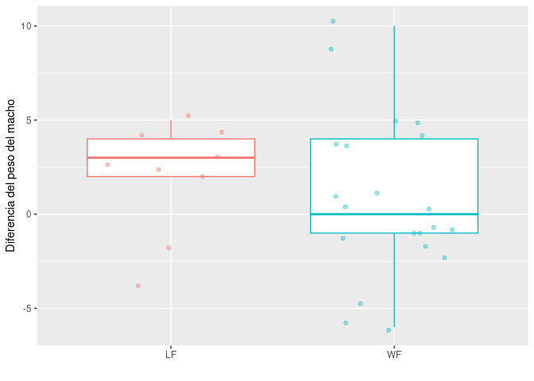
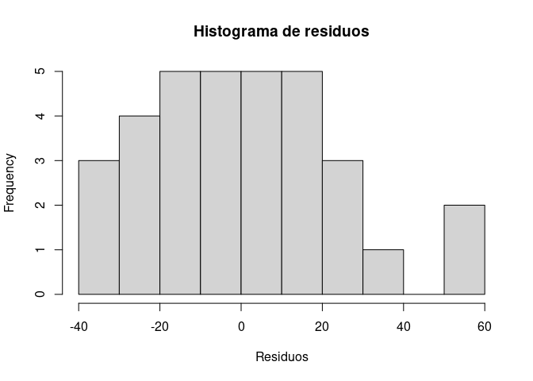
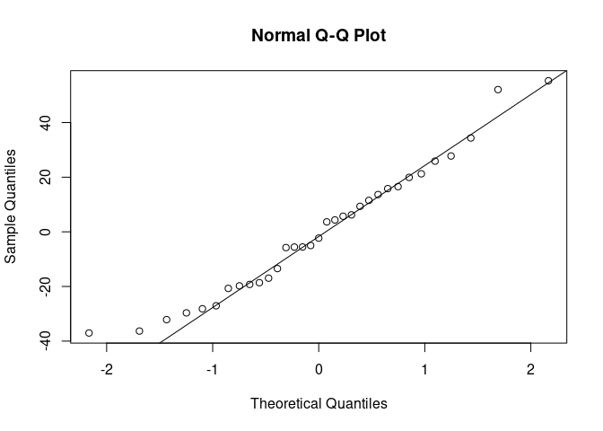
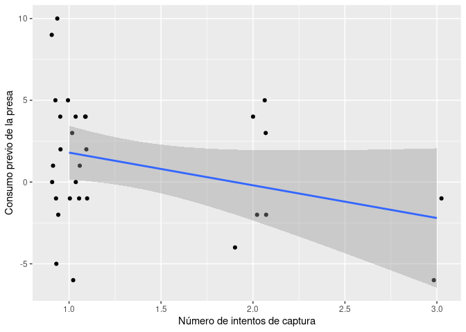

 Proyecto final de
Computación

================
Beatriz Hidalgo, Pablo Jiménez y Ángela Delgado
2025-12-17

# INTRODUCCIÓN

La araña pisaura europea o araña ladrona (*Pisaura mirabilis*) es una
especie de araña de la familia de los pisáuridos. El macho de esta
especie ofrece regalos de alimentos a las posibles compañeras.

Para ello, el macho captura una presa (generalmente un insecto) y la
envuelve **cuidadosamente en seda**. Este regalo nupcial es clave para
el éxito reproductivo, ya que:  
**- Reduce la agresividad de la hembra.**  
**- Aumenta la probabilidad de cópula.**  
**- Prolonga la duración de la transferencia de esperma.**  

Además, el tamaño del regalo nupcial puede correlacionarse con ciertos
rasgos de personalidad, como las habilidades de lucha o caza del macho.

En algunos casos, machos de menor calidad pueden **engañar**,
envolviendo presas de bajo valor nutritivo o incluso restos no
comestibles. Esto lo hacen para ahorrar esfuerzo aunque existe el riesgo
de que la hembra lo descubra y no acepte el regalo . Para evitarlo, los
machos envuelven los regalos en muchas capas adicionales de seda, para
poder aparearse antes de que la hembra los desenvuelva por completo y
descubra lo que hay dentro.

# METODOLOGÍA

En cada experimento, se colocaron arañas macho de aproximadamente la
misma edad en pequeñas cajas que previamente habían contenido arañas
hembra sexualmente receptivas, para inducirles a pensar que debían
preparar un regalo. Los experimentadores proporcionaron a los machos una
ninfa de grillo viva cerca, que presumiblemente podrían usar como
regalo. Si el macho no la atrapaba en veinte minutos, o la atrapaba pero
no hacía un regalo con ella, el experimento finaliza y se reiniciaba al
día siguiente.

Se midió el peso de la presa antes y después de convertirla en regalo,
para ver si el macho comía algo antes de envolverla. También se registró
el peso de la seda utilizada para envolver la presa.

Para llevar a cabo el análisis usamos R ([**R-base?**](#ref-R-base)) con
las librerias dplyr ([**R-dplyr?**](#ref-R-dplyr)) y ggplot
([**R-ggplot2?**](#ref-R-ggplot2);
[**ggplot22016?**](#ref-ggplot22016)). Para la creación del informe
hemos utilizado el paquete knitr ([**R-knitr?**](#ref-R-knitr);
[**knitr2015?**](#ref-knitr2015); [**knitr2014?**](#ref-knitr2014)) y
pandoc.

# HIPÓTESIS

Para nuestro proyecto vamos a proponer tres hipotesis::

- **Hipotesis 1:** Efecto del tratamiento sobre el consumo previo del
  regalo.

  - H₀: No exiten diferencias en el consumo previo del regalo entre
    tratamientos.

  - H₁: Existen diferencias entre el consumo previo del regalo entre
    tratamientos.

- **Hipótesis 2:** Relación entre el peso del macho y el peso del
  regalo.

  - H₀: No exite relación significativa entre el peso del macho y el
    peso del regalo.

  - H₁: Existe relación significativa entre el peso del macho y el peso
    del regalo.

- **Hipótesis 3:** Relación entre la inversión temporal y el consumo
  previo del regalo.

  - H₀: No exite relación significativa entre la inversión temporal y el
    consumo previo del regalo.

  - H₁: Exite relación significativa entre la inversión temporal y el
    consumo previo del regalo.

# BASE DE DATOS

<!-- Cargamos las librerías -->

<!-- Cargamos los datos -->

Estos datos fueron obtenidos en
<https://www.kaggle.com/datasets/mexwell/spider-lab-gifts>

Los datos tienen 34 filas y 15 columnas.

Cada fila corresponde a un macho distinto, por lo que en este caso
tenemos una muestra formada por 34 machos.

Cada columna corresponde con una variable. Aunque tenemos 15 variables
en nuestra base de datos para analizar nuestras hipotesis no las
necesitamos todad y hemos seleccionado las siguientes:

- **MALE ID** ID única que nos sirve para identificar a los machos.

- **FOOD TREATMENT:** dieta que reciven los machos.

  - LF: un insecto por semana.

  - WF: dos insectos por semana.

- **Gift weight (mg):** peso del regalo producido en miligramos.

- **MALE MASS BEFORE TRIAL (mg):** la masa del macho al principio del
  experimento en miligramos.

- **MALE MASS AFTER TRIAL (mg):** masa del macho despues de hacer el
  regalo en miligramos. Esta variable nos permite ver si el macho se ha
  alimentado del regalo antes de envolverlo.

- **MALE WEIGHT difference (bef-after):** diferencia de peso del macho
  antes y despues de hacer el regalo.

|  | MALE.ID | FOOD.TREATMENT | N.TRIAL | MALE.MASS.BEFORE.TRIAL..mg. | MALE.MASS.AFTER.TRIAL..mg. | Gift.weight..mg. | consumo_previo |
|:---|:--:|:--:|:--:|:--:|:--:|:--:|:--:|
| 1 | 101 | WF | 1 | 135 | 139 | 57.182 | 4 |
| 2 | 103 | LF | 2 | 64 | 60 | 34.297 | -4 |
| 3 | 106 | LF | 1 | 61 | 64 | 9.940 | 3 |
| 4 | 109 | LF | 1 | 68 | 73 | 31.072 | 5 |
| 5 | 11 | WF | 1 | 51 | 50 | 13.456 | -1 |
| 6 | 113 | WF | 1 | 144 | 144 | 20.189 | 0 |
| 8 | 115 | WF | 2 | 95 | 100 | 11.270 | 5 |
| 9 | 118 | WF | 1 | 90 | 89 | 17.352 | -1 |

Tabla 1: Ocho primeras filas base datos

# ANÁLISIS

## Hipotesis 1

- H₀: No existen diferencias en consumo previo del regalo entre los dos
  tratamiento.

- H₁: Existen diferencias en el consumo previo del regalo entre los dos
  tratamiento.

Para ello vamos a realizar un analisis t-test.

    ## 
    ##  Welch Two Sample t-test
    ## 
    ## data:  consumo_previo by FOOD.TREATMENT
    ## t = 0.78663, df = 21.948, p-value = 0.4399
    ## alternative hypothesis: true difference in means between group LF and group WF is not equal to 0
    ## 95 percent confidence interval:
    ##  -1.766661  3.925391
    ## sample estimates:
    ## mean in group LF mean in group WF 
    ##        1.8888889        0.8095238

Si observamos los resultados, vemos que el valor de p\>0.05. Esto quiere
decir que debemos rechazar la hipotesis alternativa y aceptar la nula,
es decir, no van a existir diferencias en cuanto al tratamiento con
respecto al consumo previo del regalo.

<!-- -->

## Hipotesis 2

- H₀: No existe relación entre el tamaño corporal y el peso del regalo.

- H₁: Existe una relación positiva entre el tamaño corporal y el peso
  del regalo.

Realizamos un análisis descriptivo.

    ##    Min. 1st Qu.  Median    Mean 3rd Qu.    Max.    NA's 
    ##    3.14   11.05   17.00   20.96   24.54   57.89       1

A continuación comprobamos la normalidad:

    ## 
    ## Call:
    ## lm(formula = MALE.MASS.BEFORE.TRIAL..mg. ~ Gift.weight..mg., 
    ##     data = datos)
    ## 
    ## Coefficients:
    ##      (Intercept)  Gift.weight..mg.  
    ##          72.0598            0.8241

<!-- --><!-- -->

    ## 
    ##  Shapiro-Wilk normality test
    ## 
    ## data:  res2
    ## W = 0.9658, p-value = 0.3737

    ## [1] 33

Por último, realizamos un análisis de correlación de Pearson entre el
tamaño del macho y el peso del regalo.

    ## 
    ##  Pearson's product-moment correlation
    ## 
    ## data:  datos$MALE.MASS.BEFORE.TRIAL..mg. and datos$Gift.weight..mg.
    ## t = 2.7859, df = 31, p-value = 0.009025
    ## alternative hypothesis: true correlation is not equal to 0
    ## 95 percent confidence interval:
    ##  0.1230764 0.6854812
    ## sample estimates:
    ##      cor 
    ## 0.447478

A su vez, el p-valor es \<0,05 por lo que tenemos que rechazar la
hipotesis nula y aceptar la hipotesis alternativa, es decir, que exite
una relación significativa entre el peso del macho y el peso del regalo.
Ademas de esto, la correlación es positiva por lo que indica que a mayor
peso corporal, mayor peso del regalo.

    ## `geom_smooth()` using formula = 'y ~ x'

<!-- -->

## Hipotesis 3

H₀: No existe una relación significativa entre la inversión del macho
para conseguir el regalo y el consumo del regalo.

H₁: Existe una relación significativa entre la inversión del macho para
conseguir el regalo y el consumo del regalo.

Para ver si existe relacion entre estas dos variables vamos a realizar
una regresión lineal.

    ## 
    ## Call:
    ## lm(formula = consumo_previo ~ N.TRIAL, data = datos)
    ## 
    ## Residuals:
    ##    Min     1Q Median     3Q    Max 
    ##   -7.8   -2.8   -0.3    2.2    8.2 
    ## 
    ## Coefficients:
    ##             Estimate Std. Error t value Pr(>|t|)  
    ## (Intercept)    3.800      1.717   2.213   0.0352 *
    ## N.TRIAL       -2.000      1.176  -1.701   0.1000 .
    ## ---
    ## Signif. codes:  0 '***' 0.001 '**' 0.01 '*' 0.05 '.' 0.1 ' ' 1
    ## 
    ## Residual standard error: 3.84 on 28 degrees of freedom
    ##   (4 observations deleted due to missingness)
    ## Multiple R-squared:  0.09368,    Adjusted R-squared:  0.06131 
    ## F-statistic: 2.894 on 1 and 28 DF,  p-value: 0.09999

El **p-valor es \>0,05** por lo que aceptamos la hipótesis nula, es
decir, si que no existe una relación significativa entre el tiempo
invertido por el macho en conseguir el regalo y el consumo previo.

    ## `geom_smooth()` using formula = 'y ~ x'

<!-- -->

# CONCLUSIONES

De cada una de las hipotesis podemos sacar diferentes conclusiones:

- Los machos de ambos tratamientos consumen el regalo independientemente
  de su alimentación. Esto nos podria indicar que existen otros factores
  que influyan en el que el macho se alimente previamente del regalo
  antes de envolverlo.

- Que machos con un mayor peso corporal sean capaces de capturar regalos
  de mayor peso nos indica que sus aptitudes físicas son mejores, y por
  lo tanto va a poder capturar regalos más grande paara ofrecerle a la
  hembra.

- El hecho de que los machos , a pesar de invertir mucho tiempo en
  conseguir el regalo sigan consumiendo parte de el nos puede indicar
  que los machos anteponen sus supervivencia para así volver a tener la
  oportunidad de reproducirse.

# BIBLIOGRAFÍA

Beyer et al. Beyer et al. ([2025](#ref-beyer2025)) analizan la variación
conductual individual.

Beyer, M., P. Dudová, S. Kralj-Fišer, et al. 2025. “The Role of
Among-Individual Behavioural Variation in the Mating Outcome of the
Spider Pisaura Mirabilis.” *Behavioral Ecology and Sociobiology* 79: 95.
<https://doi.org/10.1007/s00265-025-03642-z>.

